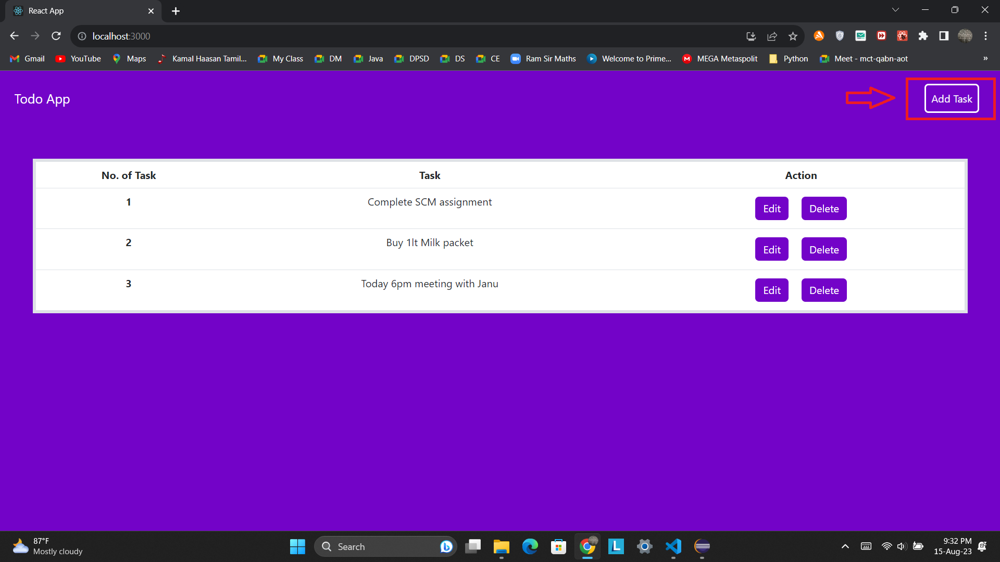
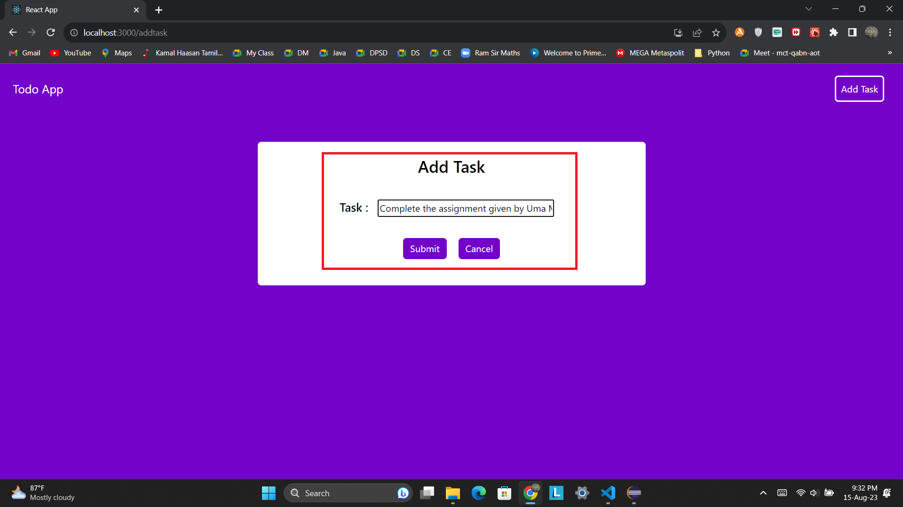
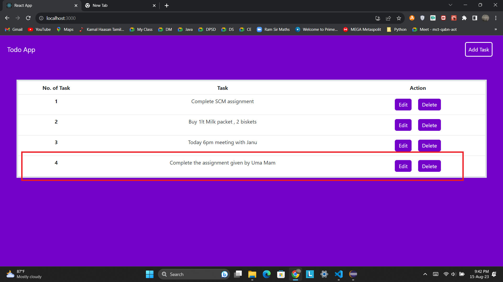
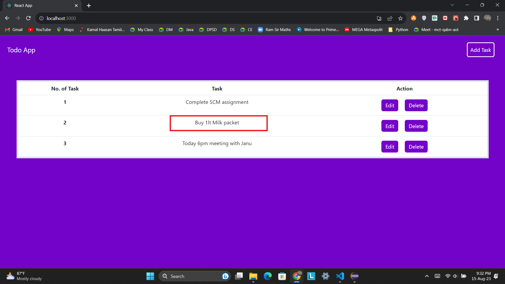
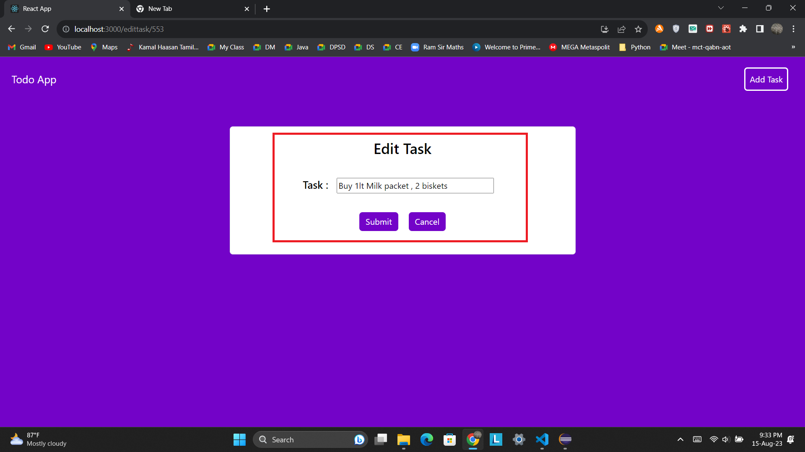

# React Springboot Todo App

My **Todo app** is a task management app to help you stay organized and manage your day-to-day. You can use my To Do to make shopping lists or task lists, take notes, record collections, plan an event, or set reminders to increase your productivity and focus on what matters to you.

 

## Tech Stack :
- Front end : React, Bootstrap
- Back end : Springboot
- Database : Mysql

 

## Add Task :
> - By clicking **add task** button we can add new task.
>> 

 
  
## Add Task Component :
> - Write your task and add it to **todo list**.
>>

 

## New Task Added :
> - Our task will be added in **todo list**, later we can edit or delete if completed.
>> 

 

## Edit Task :
> - By clicking **edit task** button we can edit our task. 
>> 

 

## Edit Task Component :
> - We can edit our task if any thing is changed.
>> 

 

## Task get Edited :
> - Similarly, we can alos delete task when they get completed.
>> 

 
