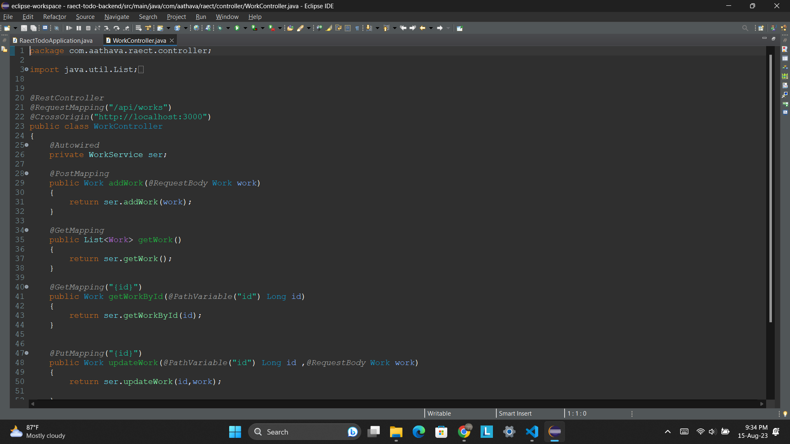
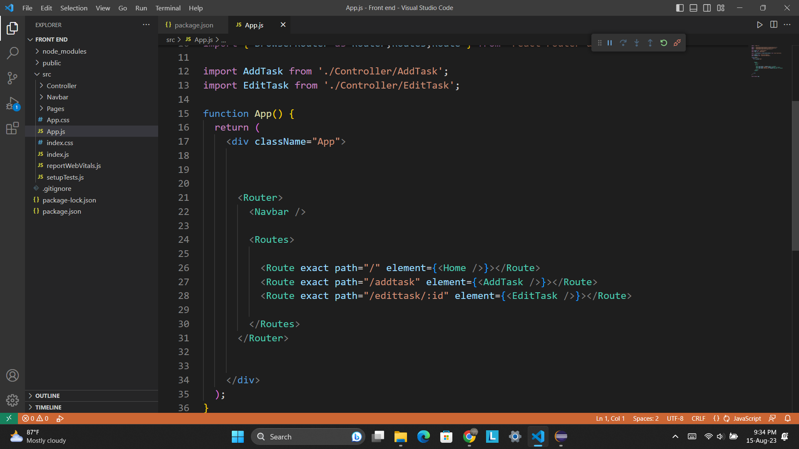

# React Springboot Todo App

My **Todo app** is a task management app to help you stay organized and manage your day-to-day. You can use my To Do to make shopping lists or task lists, take notes, record collections, plan an event, or set reminders to increase your productivity and focus on what matters to you.

## Tech Stack :
- Front end : React, Bootstrap
- Back end : Springboot
- Database : Mysql

## Add Task :

## New Task Added :

## Edit Task :

## Task get Edited :

## Delete Task :

## Task get Deleted :

## Backend Code Demo :

## Frontend Code Demo :

